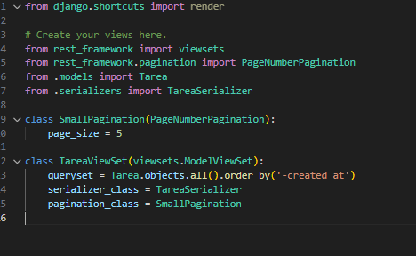
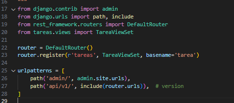
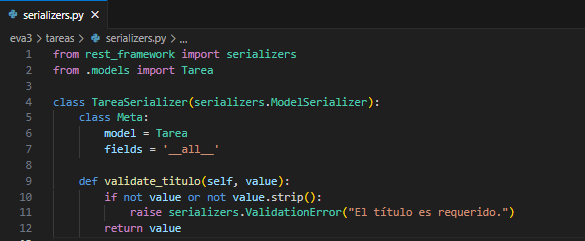
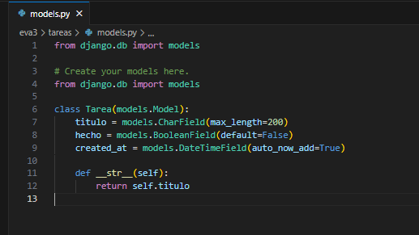
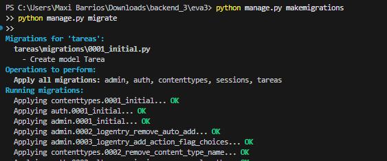
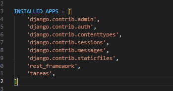
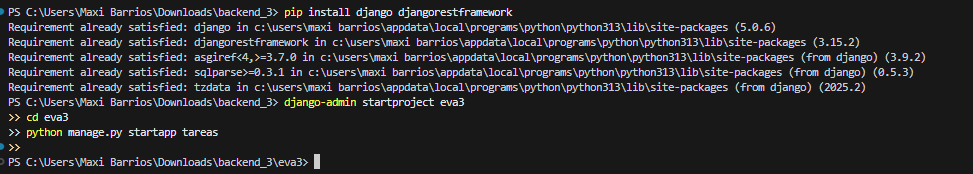

# Maximiliano Barrios

# EVA3 – API de Tareas (Django + DRF)

Este proyecto implementa una API REST en **Django Rest Framework**, que permite gestionar tareas (`Tarea`) de forma simple y ordenada.  
El sistema sigue buenas prácticas REST y está probado con Postman.

---

## 🧩 1) Descripción general

La API permite realizar operaciones CRUD sobre el recurso **Tarea**, que tiene los siguientes campos:

| Campo | Tipo | Descripción |
|--------|------|-------------|
| `titulo` | Texto | Nombre o descripción de la tarea |
| `hecho` | Booleano | Marca si la tarea está terminada |
| `created_at` | Fecha | Se genera automáticamente al crear la tarea |

---

## 🌐 2) Recursos, Verbos y Códigos HTTP

| Recurso | Verbo | Descripción | Códigos esperados |
|----------|--------|-------------|------------------|
| `/api/v1/tareas/` | **GET** | Lista todas las tareas | `200 OK` |
| `/api/v1/tareas/` | **POST** | Crea una nueva tarea | `201 Created`, `400 Bad Request` |
| `/api/v1/tareas/{id}/` | **GET** | Obtiene detalle por ID | `200 OK`, `404 Not Found` |
| `/api/v1/tareas/{id}/` | **PATCH** | Actualiza parcialmente | `200 OK`, `400 Bad Request` |
| `/api/v1/tareas/{id}/` | **DELETE** | Elimina una tarea | `204 No Content`, `404 Not Found` |

📍 **Base URL:** `http://127.0.0.1:8000/api/v1/tareas/`  
📦 **Formato:** JSON (`Content-Type: application/json`)

---
### 2.1)🧱 Descripción de cada capa

- **[Cliente (curl/SPA)]** → Envía solicitudes HTTP a la API y muestra las respuestas JSON (por ejemplo, desde Postman, navegador o una aplicación React).  
- **HTTP/JSON** → Es el medio de comunicación entre cliente y servidor, usando peticiones y respuestas en formato JSON.  
- **[API /api/v1 (DRF ViewSets/URLs)]** → Recibe las solicitudes, las enruta a las vistas correctas y gestiona los endpoints principales de la API.  
- **[Lógica / Serializers (validación)]** → Valida los datos, convierte entre JSON y objetos Python, y aplica reglas antes de guardar o devolver información.  
- **[Modelo Django (ORM)]** → Define la estructura de los datos (modelo `Tarea`) y controla cómo se almacenan o consultan en la base de datos.  
- **[DB SQLite (local)]** → Guarda de forma persistente toda la información del sistema, incluyendo las tareas creadas o modificadas.
---

## 🧠 3) Conceptos REST (explicados con mis palabras)

- **Stateless:**  
  Cada request es independiente. El servidor no guarda sesión del usuario.  
  Si borro o creo algo, cada acción es aislada.

- **JSON:**  
  Es el formato estándar que usamos para enviar y recibir datos.

- **Versionado (`/api/v1/`):**  
  Agregar la versión en la ruta permite futuras actualizaciones sin romper clientes.

- **Idempotencia:**  
  Si repito un PATCH o DELETE, el resultado final es el mismo (no cambia más).

---

## ⚙️ 4) Arquitectura por capas (explicada paso a paso)


### 🧍 Cliente (curl / SPA)
Es el usuario o herramienta (Postman, navegador, React, etc.) que envía peticiones HTTP a la API.
> En esta capa se hacen pruebas con Postman.

### 🌐 API /api/v1 (DRF ViewSets / URLs)
Recibe las peticiones y decide qué acción ejecutar (listar, crear, editar o eliminar).  
El enrutamiento lo maneja **urls.py** y la lógica está en **views.py**.

📸   
📸 

---

### 🧩 Lógica / Serializers (validación)
Convierte los datos JSON en objetos Python y valida campos antes de guardar en la base.  
Si el dato es inválido, retorna error `400 Bad Request`.

📸 

---

### 🧱 Modelo Django (ORM)
Define la estructura del dato (`Tarea`).  
Cada instancia se guarda en la base de datos.

📸 

---

### 💾 DB SQLite (local)
Base de datos liviana usada en desarrollo.  
Guarda las tareas creadas desde la API o el admin.

📸 

---

## ⚙️ 5) Configuración y vistas principales

📸   
📸 

---

## 🧩 6) Cómo ejecutar el proyecto

```bash
# Crear entorno virtual
python -m venv .venv
source .venv/bin/activate      # Windows: .venv\Scripts\activate

# Instalar dependencias
pip install -r requirements.txt

# Migraciones
python manage.py migrate

# Ejecutar servidor
python manage.py runserver


