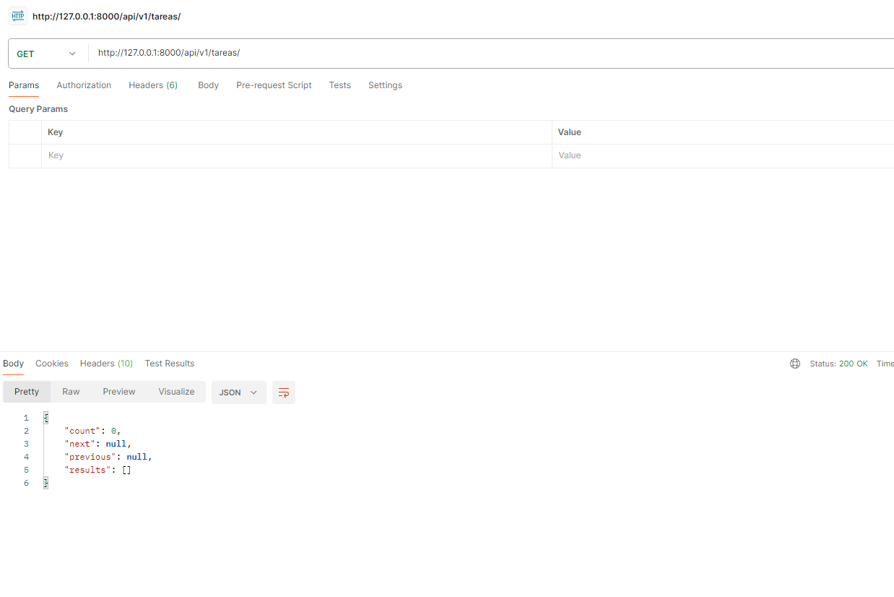
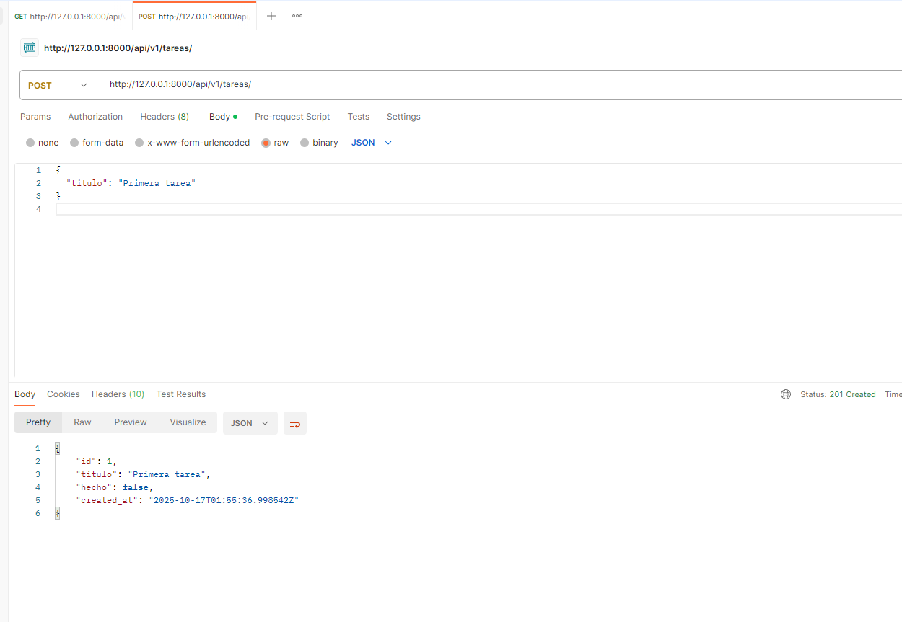
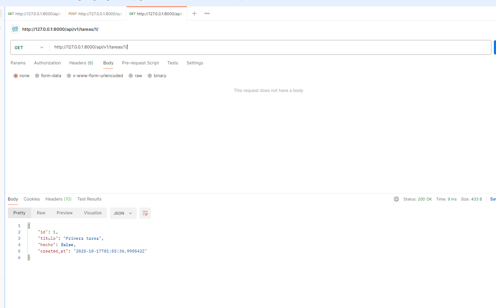
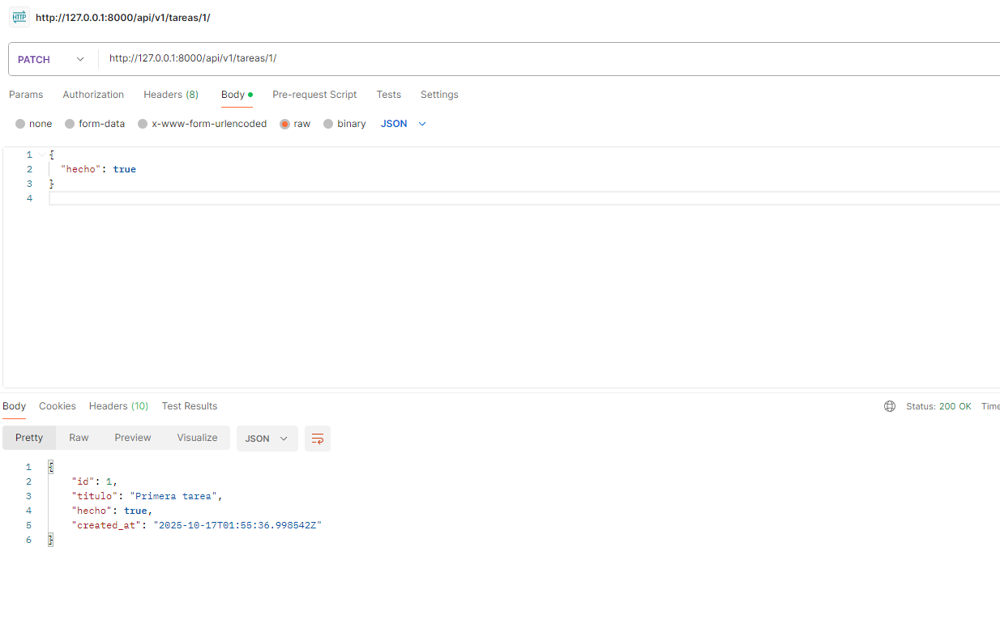
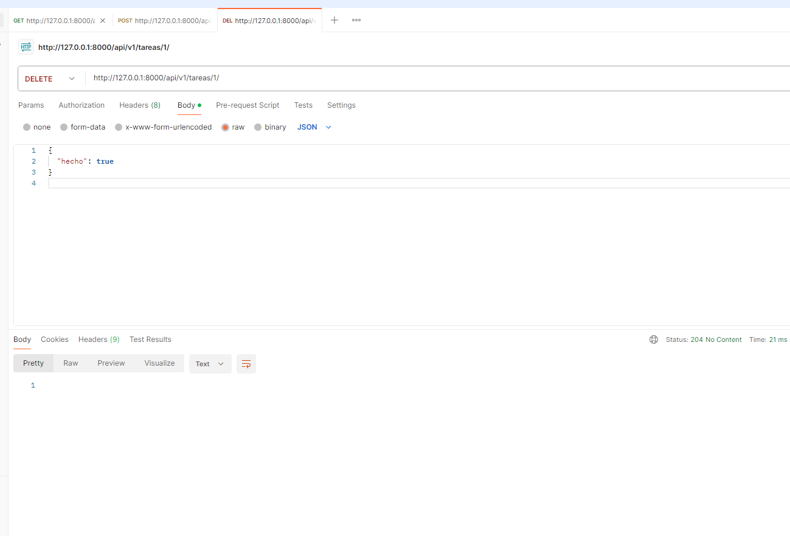
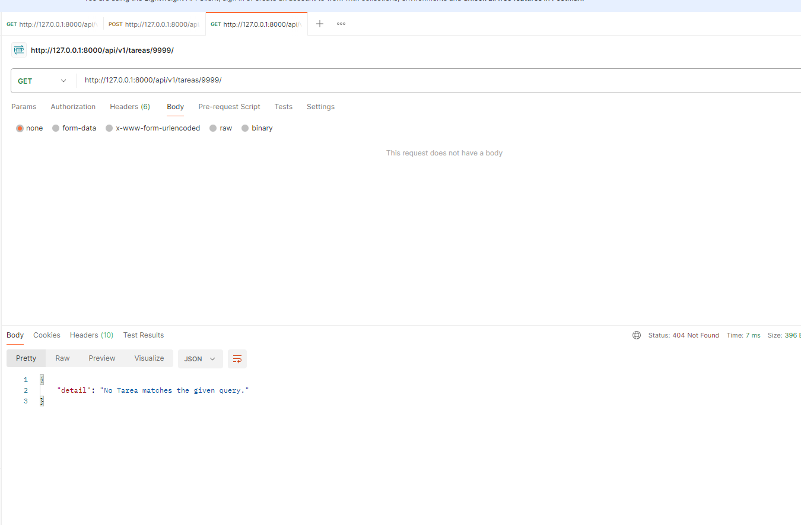
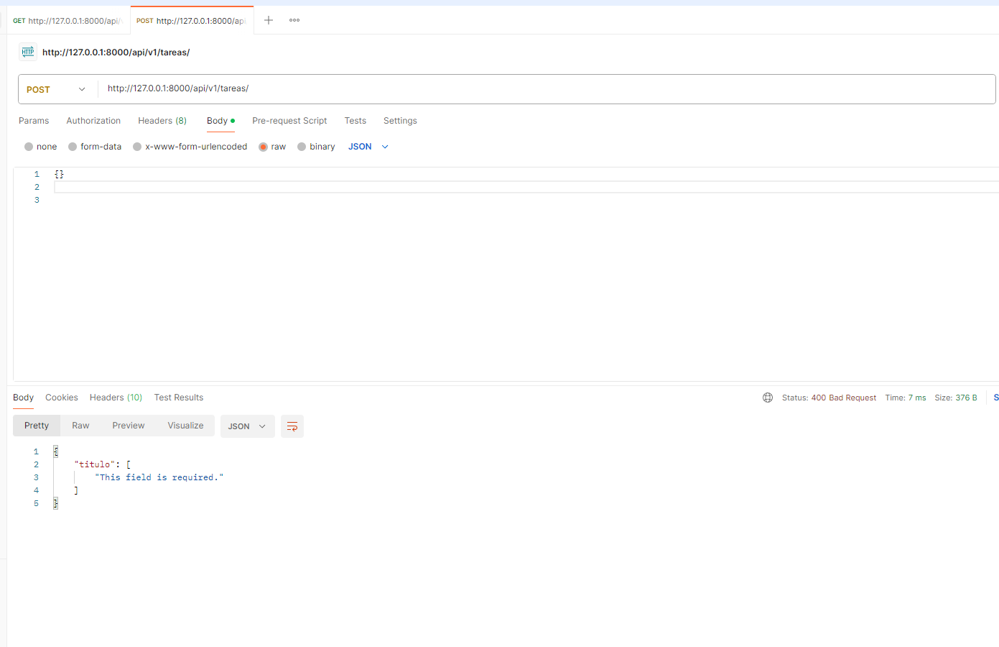

---

## 📂 01 – Listar y Crear

### ✅ GET /tareas/ → 200 OK  
Lista todas las tareas registradas.  

### ✅ POST /tareas/ → 201 Created  
Crea una nueva tarea con título.  

---

## 📂 02 – Detalle y Edición

### ✅ GET /tareas/1/ → 200 OK  
Muestra la información completa de una tarea existente.  

### ✅ PATCH /tareas/1/ → 200 OK  
Actualiza parcialmente (por ejemplo, marcar como hecha).  

---

## 📂 03 – Borrado y Errores

### ✅ DELETE /tareas/1/ → 204 No Content  
Elimina la tarea seleccionada correctamente.  

### ⚠️ GET /tareas/99999/ → 404 Not Found  
Intenta acceder a una tarea inexistente.  

### ⚠️ POST inválido → 400 Bad Request  
Intenta crear una tarea vacía o con datos inválidos.  

---

## 📸 Resumen de Evidencias

| Prueba | Método | Código | Evidencia |
|--------|---------|---------|------------|
| Listar tareas | GET | 200 OK | ✅ `postman_listar.png` |
| Crear tarea | POST | 201 Created | ✅ `postman_crear_201.png` |
| Detalle tarea | GET | 200 OK | ✅ `postman_detalle_200.png` |
| Actualizar tarea | PATCH | 200 OK | ✅ `postman_patch_200.png` |
| Eliminar tarea | DELETE | 204 No Content | ✅ `postman_delete_204.png` |
| ID inexistente | GET | 404 Not Found | ⚠️ `postman_404.png` |
| Error validación | POST | 400 Bad Request | ⚠️ `postman_400.png` |

---
